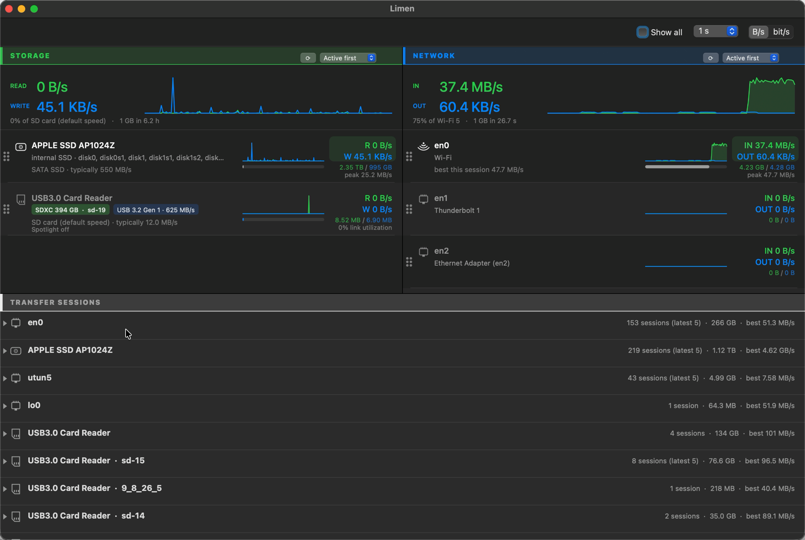

# Bottleneck

Your transfers' throughput, and what's limiting it. Per-device storage and network
rates for macOS, with a session history and evidence-backed readings of what held
each copy back.



`iostat -w 1 disk0 disk2` will give you per-disk throughput already. Bottleneck maps those
devices back to product names and mounted volumes, separates reads from writes, puts
storage and interfaces on one screen, keeps a history of finished transfers, and shows
the evidence behind each hint.

## Download

[**Bottleneck-universal.zip**](https://github.com/cpatil/bottleneck/releases/latest/download/Bottleneck-universal.zip)
— one build for Intel and Apple Silicon.

It is ad-hoc signed and **not notarised**, so Gatekeeper will refuse it. That means you
are being asked to trust an unsigned binary from a stranger, for a program that
enumerates processes and open file descriptors. Building from source is the better
path, and takes about ten seconds:

```bash
./build.sh          # -> build/Bottleneck.app
open build/Bottleneck.app
```

If you do want the download, verify it against the checksum published in the
[release notes](https://github.com/cpatil/bottleneck/releases/latest) first, then:

```bash
shasum -a 256 Bottleneck-universal.zip     # compare with the release notes
xattr -dr com.apple.quarantine Bottleneck.app
```

Without the Terminal: double-click the app, let macOS block it, then **System Settings
▸ Privacy & Security ▸ Security ▸ Open Anyway**. The button only appears after a
blocked attempt and is withdrawn again after a while, so open the app first.
Control-clicking and choosing Open no longer works — macOS Sequoia removed that route.

The build is reproducible: a clean checkout produces a byte-identical executable, so
you can confirm the download matches the source rather than taking my word for it.

**Tested on:** macOS 11.7.11 / Intel (2015 MacBook) and macOS 26 / Apple Silicon, from
this same universal binary. The Intel slice targets 10.14.4 — the release where
Swift's ABI-stable runtime arrived in the OS, since no Swift libraries are embedded —
but nothing between 10.14.4 and 11.7 has been tested. The arm64 slice targets 11.0,
as low as Apple Silicon goes.

`./test.sh` runs 219 checks. `./deploy.sh <ssh-host>` builds and installs on another
Mac over SSH.

## Where the numbers come from

Storage throughput is `IOBlockStorageDriver`'s `Statistics` dictionary. Network is
`sysctl(NET_RT_IFLIST2)` with the 64-bit `if_data64` — the easier `getifaddrs` path
gives you 32-bit counters that wrap every 4 GB.

Only hardware interfaces are listed. A VPN tunnel or a bridge carries traffic that is
*also* counted on the interface underneath it, so listing both puts the same bytes on
screen twice and summing them reports roughly double. **Show all** brings back tunnels,
bridges, loopback and the long tail of virtual interfaces.

Byte counters are the part Bottleneck is confident about. Everything downstream of them —
which component was the bottleneck, which process moved which bytes, why a card took
writes — is inference, and the interface tries to say which is which.

## What it can't do

- macOS keeps no general per-USB byte counters, so a keyboard or an audio interface
  gets its link speed and nothing else. Those rows say so instead of drawing a flat
  line that looks idle.
- **Process attribution is an association, not accounting.** `proc_pid_rusage` reports
  a process's disk I/O as a whole; the open-descriptor check only establishes that the
  process holds a file on that volume. A process reading hard from one disk while
  holding a file open on another will show its whole rate against both. Processes
  owned by other users need root, so they are missing entirely.
- Wi-Fi's reported link rate is not usable as a ceiling — mine claimed 304 Mbit/s
  while sustaining 30.2, and logged a peak above its own stated rate. Those rows show
  the session's best instead, and Bottleneck does not try to name a Wi-Fi generation from
  throughput, because throughput cannot identify one.
- Port generation is not claimed on Intel Macs. IOKit exposes Thunderbolt controllers
  but not their version, and a 2015 15" MacBook Pro has Thunderbolt 2 at 20 Gbit/s,
  not USB4.

## Rates need a denominator

"111 MB/s" means nothing alone, so rows say what the rate is comparable to and draw a
bar for how much of the device's capability is in use. Where the negotiated link rate
is believable that is a real proportion — `19% link utilization`. Where it is not
(Wi-Fi, an internal drive) the bar measures against what that class of device typically
manages — `36% of typical` — which is approximate but is still a statement about
capability. It never measures a device against its own past: "50% of its own peak" only
says whether it is working as hard as it has before, which is not a capacity and does
not belong in a bar that looks like one.

Utilisation is per direction, not the sum — links are full duplex, and a gigabit
interface doing 600 Mbit/s each way is at 60% each way, not 128% of one ceiling.

Ceilings are realistic rather than advertised: 8b/10b coding costs USB 3.0 a fifth of
its headline number before framing, so "5 Gbit/s" is treated as ~450 MB/s.

## Ordering

Each section sorts independently, chosen from the popup in its heading.

**Active first is held, not recomputed.** It is worked out when Bottleneck starts and then
left alone, because re-running it every second means rows swap places while you are
reading them — which is the thing that sort was supposed to avoid. **Re-sort** in the
toolbar (or ⌘R) asks for it to be reconsidered. Devices that appear afterwards are
appended rather than barging into the middle. Sorting by rate or by total still tracks
the live figures, since choosing those is choosing that behaviour.

Rows have a drag handle in the left margin. The row lifts and follows the pointer, the
list reflows around it, and letting go switches that section to a custom order and
remembers it. The whole row is draggable; the grip is there to say so.

Comparisons stay inside the right kind of medium — a card against cards, a drive
against drives, an internal drive against media that can live inside a machine.
Getting this wrong is how an early build reported that my internal SSD was running at
"52% of an SD card".

Capacity class for a card is exact, because the SD spec draws SDHC/SDXC strictly by
size. Speed class is *not* — a USB reader presents the card as generic mass storage,
so a plateau near a known ceiling is reported as consistent with that class, not as
proof of it. The reader, the destination, the filesystem and the workload are all
alternative explanations Bottleneck cannot rule out.

## Spotlight

Anything you plug in says whether Spotlight is indexing it, at the end of the line
under its name — quietly when it is off, in red when it is not. Indexing a card you only import from buys
nothing and costs wear and bandwidth, and right-clicking the row stops it for good.

The badge reads `.metadata_never_index`, a positive statement that indexing is off,
rather than the presence of a `.Spotlight-V100` directory — that survives indexing
being disabled and would keep the light red for no reason.

Internal drives are left out of this. Indexing the boot disk is what makes the machine
searchable; flagging it would be advice nobody should take.

## The Cards menu

Two things Bottleneck can do by itself when a memory card is inserted, both off until you
turn them on:

- **Open Bottleneck When a Card Is Inserted** — so a transfer is recorded from the first
  byte rather than from whenever you think to look.
- **Stop Spotlight Indexing New Cards** — writes the marker as the card mounts.

They are carried out by a small LaunchAgent watching `/Volumes`, installed when the
first switch goes on and removed when the last goes off. It acts on cards only: a
mounted disk image reports itself as removable media, so the gate also requires the
protocol to be USB or Secure Digital.

## How full a device is

A level in its own lane between the icon and the name, filled from the bottom: green
while there is room, amber past 70%, red past 90%. The hover card gives the figures.

Counted **once per container**. Volumes in one APFS container each report the
container's capacity and free space as their own, so a disk with four volumes mounted
says "3.6 TB, 1.14 TB free" four times over — adding them claims 14.4 TB of disk. This
is the same shape of mistake as listing a VPN tunnel alongside the interface it rides
over, and it is counted once for the same reason.

Per-volume usage is not available from `statfs` at all — every volume in a container
returns byte-identical figures. Finder and `df` get it from APFS directly. For "how
full is this device" that does not matter: the container's used and free are what the
device holds.

## Sessions

Finished copies are logged with what was measured and what it might mean. The one
that prompted the feature, from a single 167-second window:

```
read 474 MB · written 579 MB · avg 6.3 MB/s · peak 20.1 MB/s
```

More was written to the card than read from it, while I was only importing. Across all
six sessions with that card: 30.2 GB read, 6.13 GB written. Spotlight was indexing it
and the volume was journalled and mounted without `noatime`. After disabling indexing,
the same card's best recorded peak was 96.5 MB/s.

Bottleneck reports the byte counts as fact and the causes as things to check, because it
observes that writes happened, not who issued them.

Sessions are kept in `~/Library/Application Support/Bottleneck/history.json` — up to 500
entries, unencrypted, holding device and volume names, process names, timestamps, byte
counts and rates. Nothing leaves the machine, but it is worth knowing the file exists
before sharing diagnostics. Right-click the log to clear a device or the lot.

## First run

A setup window appears the first time, and is available afterwards from Help ▸ Setup
and Tour. It is not a slideshow: each step checks the thing it describes and reports
what it found — where the app is installed, whether the copy is still quarantined, and
whether removable-volume access is actually working — with a button to fix it and one
to check again.

Bottleneck needs no permission for anything it measures. The single optional one is
removable volumes, and only for writing the marker that stops Spotlight indexing a card.

## Anything it does can be undone

A guiding principle rather than a feature list. Every change Bottleneck makes outside itself
has a way back, offered where the change was made:

| What it does | How to undo it |
|---|---|
| Writes `.metadata_never_index` to a card | The same right-click item, which reads *Let Spotlight Index … Again* |
| Installs the card watcher | Removed when both Cards switches are off |
| Clears the transfer log | **Undo Last Clear** in the log's right-click menu |
| Downloads a newer speed catalogue | **Use the Built-in Speed Catalogue** |
| Remembers layout, sorting, units | **Reset Settings…** — leaves your log and your cards alone |
| Anything the Cards menu switched on | Switch it off; the watcher is removed with the last one |
| Pins a hover card open | The cross on the card, Escape, or clicking the same row again |

Where something is genuinely irreversible it asks first, rather than succeeding quietly.

## Nothing is truncated without a way to read it

Rows shorten what does not fit. Everything they shorten — the device name, the vendor,
the identifier, the volumes, the comparison line, the recommendation — is carried in
full by the card that appears on hover, and by **Copy** in the right-click menu. If a
string is clipped anywhere with no way to see it whole, that is a bug.

## What is measured and what is inferred

Byte counters are measured. Almost everything else on screen is a reading of them, and
the interface tries to keep the difference visible.

Anything Bottleneck worked out rather than read carries **≈** and is drawn in violet: the SD
family of a card, a rate compared against what that class of device typically manages,
what limited a transfer, what would help. Violet is the only hue not already spoken for
by something measured — green and blue are the two directions, orange is a link at its
ceiling, red is a warning, and the capacity level runs green through amber to red — so
it cannot be mistaken for a rate. The mark, not the colour, is what carries the meaning:
it survives greyscale, colour blindness and the accessibility description, where the
colour does not.

**Color key** at the top left opens it, the information button beside it explains the
difference at length, and Help ▸ What the Colors Mean does both. Hovering a row brings up its card, which says what
each conclusion on that row was drawn from; clicking a row keeps that card open —
with a cross to dismiss it, or Escape — so it can be read and copied from without the
pointer having to stay still.

A marker file on a card is a fact, so `Spotlight off` is stated plainly. Its absence
only means nothing is stopping Spotlight, so that reads `Spotlight not blocked` — Bottleneck
does not check whether indexing is actually running. A rate near a known ceiling is
`consistent with` that ceiling, not proof of it; the reader, the destination, the
filesystem and the workload are alternatives it cannot rule out. A check that could not
run says so instead of showing a tick it has not earned.

## Notes

No network access at all. The speed catalogue ships inside the binary and only updates
when you choose the menu item.

One instance at a time, enforced with a file lock. LaunchServices already refuses a
second copy of the same bundle, but a copy in `~/Downloads` and one in `/Applications`
are different bundles to it, and running the executable inside a bundle directly
bypasses it. Two instances both write the session log and neither knows about the
other's transfers, so the last one to save discards the other's.

The rows are custom-drawn, so they are published to VoiceOver explicitly: each device
and each session is an accessibility row with a spoken summary ("en0, IN 67.6 KB/s,
OUT 17.7 MB/s, 34% link utilization"). Keyboard equivalents for reorder and fold are
still missing.

Idle cost is about 1% CPU and 40 MB RSS on a 2015 12" MacBook at the 1-second
interval; the per-tick process scan is the bulk of it, so longer intervals cost less.

MIT — see [LICENSE](LICENSE).
