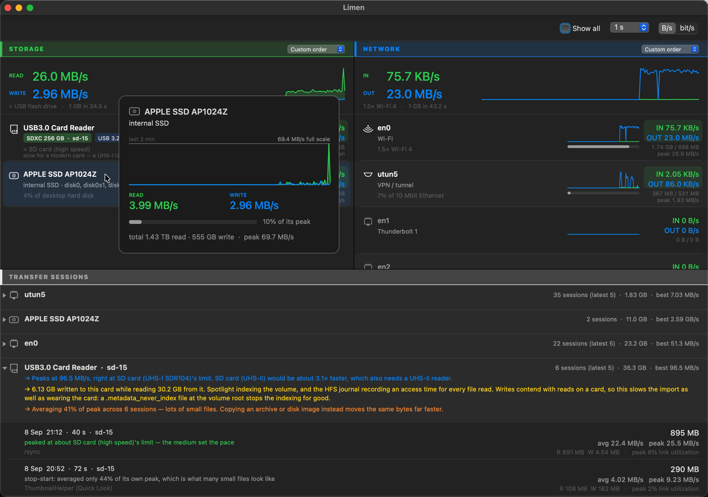

# Limen

Per-device storage and network rates for macOS, with a transfer history and
best-effort hints about what limited a copy.



`iostat -w 1 disk0 disk2` will give you per-disk throughput already. Limen maps those
devices back to product names and mounted volumes, separates reads from writes, puts
storage and interfaces on one screen, keeps a history of finished transfers, and shows
the evidence behind each hint.

## Download

[**Limen-universal.zip**](https://github.com/cpatil/limen/releases/latest/download/Limen-universal.zip)
— one build for Intel and Apple Silicon.

It is ad-hoc signed and **not notarised**, so Gatekeeper will refuse it. That means you
are being asked to trust an unsigned binary from a stranger, for a program that
enumerates processes and open file descriptors. Building from source is the better
path, and takes about ten seconds:

```bash
./build.sh          # -> build/Limen.app
open build/Limen.app
```

If you do want the download, verify it against the checksum published in the
[release notes](https://github.com/cpatil/limen/releases/latest) first, then:

```bash
shasum -a 256 Limen-universal.zip     # compare with the release notes
xattr -dr com.apple.quarantine Limen.app
```

The build is reproducible: a clean checkout produces a byte-identical executable, so
you can confirm the download matches the source rather than taking my word for it.

**Tested on:** macOS 11.7.11 / Intel (2015 MacBook) and macOS 26 / Apple Silicon, from
this same universal binary. The Intel slice targets 10.14.4 — the release where
Swift's ABI-stable runtime arrived in the OS, since no Swift libraries are embedded —
but nothing between 10.14.4 and 11.7 has been tested. The arm64 slice targets 11.0,
as low as Apple Silicon goes.

`./test.sh` runs the checks. `./deploy.sh <ssh-host>` builds and installs on another
Mac over SSH.

## Where the numbers come from

Storage throughput is `IOBlockStorageDriver`'s `Statistics` dictionary. Network is
`sysctl(NET_RT_IFLIST2)` with the 64-bit `if_data64` — the easier `getifaddrs` path
gives you 32-bit counters that wrap every 4 GB.

The headline network total counts hardware interfaces only. A VPN tunnel or a bridge
carries traffic that is *also* counted on the physical interface underneath it, so
summing everything reports roughly double.

Byte counters are the part Limen is confident about. Everything downstream of them —
which component was the bottleneck, which process moved which bytes, why a card took
writes — is inference, and the interface tries to say which is which.

## What it can't do

- macOS keeps no general per-USB byte counters, so a keyboard or an audio interface
  gets its link speed and nothing else. Those rows say so instead of drawing a flat
  line that looks idle.
- **Process attribution is an association, not accounting.** `proc_pid_rusage` reports
  a process's disk I/O as a whole; the open-descriptor check only establishes that the
  process holds a file on that volume. A process reading hard from one disk while
  holding a file open on another will show its whole rate against both. Processes
  owned by other users need root, so they are missing entirely.
- Wi-Fi's reported link rate is not usable as a ceiling — mine claimed 304 Mbit/s
  while sustaining 30.2, and logged a peak above its own stated rate. Those rows show
  the session's best instead, and Limen does not try to name a Wi-Fi generation from
  throughput, because throughput cannot identify one.
- Port generation is not claimed on Intel Macs. IOKit exposes Thunderbolt controllers
  but not their version, and a 2015 15" MacBook Pro has Thunderbolt 2 at 20 Gbit/s,
  not USB4.

## Rates need a denominator

"111 MB/s" means nothing alone, so rows say what the rate is comparable to and how
much of the link is in use. Utilisation is per direction, not the sum — links are full
duplex, and a gigabit interface doing 600 Mbit/s each way is at 60% each way, not 128%
of one ceiling.

Ceilings are realistic rather than advertised: 8b/10b coding costs USB 3.0 a fifth of
its headline number before framing, so "5 Gbit/s" is treated as ~450 MB/s.

Comparisons stay inside the right kind of medium — a card against cards, a drive
against drives, an internal drive against media that can live inside a machine.
Getting this wrong is how an early build reported that my internal SSD was running at
"52% of an SD card".

Capacity class for a card is exact, because the SD spec draws SDHC/SDXC strictly by
size. Speed class is *not* — a USB reader presents the card as generic mass storage,
so a plateau near a known ceiling is reported as consistent with that class, not as
proof of it. The reader, the destination, the filesystem and the workload are all
alternative explanations Limen cannot rule out.

## Transfer sessions

Finished copies are logged with what was measured and what it might mean. The one
that prompted the feature, from a single 167-second window:

```
read 474 MB · written 579 MB · avg 6.3 MB/s · peak 20.1 MB/s
```

More was written to the card than read from it, while I was only importing. Across all
six sessions with that card: 30.2 GB read, 6.13 GB written. Spotlight was indexing it
and the volume was journalled and mounted without `noatime`. After disabling indexing,
the same card's best recorded peak was 96.5 MB/s.

Limen reports the byte counts as fact and the causes as things to check, because it
observes that writes happened, not who issued them.

Sessions are kept in `~/Library/Application Support/Limen/history.json` — up to 500
entries, unencrypted, holding device and volume names, process names, timestamps, byte
counts and rates. Nothing leaves the machine, but it is worth knowing the file exists
before sharing diagnostics. Right-click the log to clear a device or the lot.

## Notes

No network access at all. The speed catalogue ships inside the binary and only updates
when you choose the menu item.

The rows are custom-drawn, so they are published to VoiceOver explicitly: each device
and each session is an accessibility row with a spoken summary ("en0, IN 67.6 KB/s,
OUT 17.7 MB/s, 34% link utilization"). Keyboard equivalents for reorder and fold are
still missing.

Idle cost is about 1% CPU and 40 MB RSS on a 2015 12" MacBook at the 1-second
interval; the per-tick process scan is the bulk of it, so longer intervals cost less.

MIT — see [LICENSE](LICENSE).
